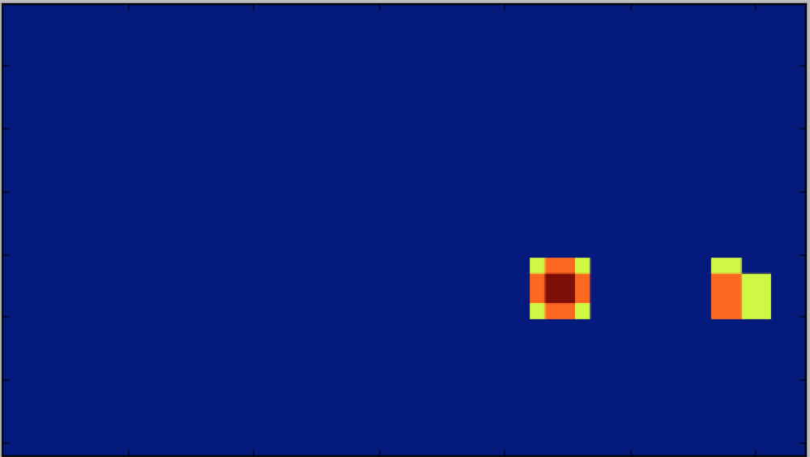

# Vehicle detection and tracking

---

## Overview ##
In a video, finds the cars and tracks their movement. Input is project_video, output is in two parts, project_output1.mp4 and project_output2.mp4

Steps: 

1. Perform HOG feature extraction on car & non-car images 
1. Normalize features, randomize, and train a Linear SVM classifier 
1. Search for vehicles in images using sliding windows
1. Use time-series heat map to reject outliers and follow detected vehicles
1. Run pipeline on a video stream

---
## Methodology ##

###1. Perform HOG feature extraction on car & non-car images 

**helpers.py:** 

get_hog_features(): Given the inputed number of orientations, number of pixels per cell, and numbers of cells per block (for block normalization), the hog features are taken and returned. Optionally, visualization is returned for visual testing. 

Number of orientations, pixels per cell, and numbers of cells per block were all experimented with. Training accuracy was not significantly affected from changes, so the values were left at their original starting values. 

Optionally, use a histogram of colors with color_hist() and a feature vector of the colors themselves with bin_spatial() for training the SVC. Given that these add time to model training and did not significantly affect training scores, they are not used in the final product.

extract_features(): Converts to the desired color spectrum and puts the hog_features and any other feature vectors together (no other feature vectors used in final product). 

Through experimentation with YCrCb, YUV, HLS, HSV, and RGB color spectrums, the YCrCb was found to be optimal for training the SVC (all three color channels). This is interesting since the Y channel appears to have significant differences between cars and non-cars, whereas the Cr and Cb seem to carry little value, but using all three channels does improve training accuracy over just the Y channel.

###2. Normalize features, randomize, and train a Linear SVM classifier 

**search_classify.py:**

In the main body of the python file, the model is trained if it hasn't been trained before. Roughly 9k 64x64 labeled images of cars and 9k 64x64 images of noncars were extracted. The features for all the car images and not-car images were taken and v-stacked together. 

Then, the features are standardized using an X scaler to be of 0 mean and equal variance. This ensures that some feature's scores do not have an outsize impact on the results of the model training.

The labels for these images were h-stacked. The data is shuffled and split into a training (80%) and testing (20%) data set. 

A linear SVM classifier is fit to the data, and a prediction is output. The final model reached a 99% accuracy in determining cars from non-cars. 

###3. Search for vehicles in images using sliding windows

**search_classify.py:**

find_cars(): Given an image and the parameters mentioned above that were used to train the model, the hog features (and optionally other features) are calculated for the 3 color channels (Y, Cr, Cb). 

Then, a sliding window is run across the bottom right quarter of the image (to avoid false positives in the sky and left side of road). For that given sliding window, the hog features for that part are taken out, and any cars that are found are bound with a box. This box can optionally be drawn onto the image for visual testing, but in the final implementation is added to the list of all bounding boxes and returned.

Scales from .5 to 5 were experimented with, with .5 scales having very small windows and 5 having very large. Through experimentation, it was found that using 3 sliding windows at .9, 1, and 1.5 scales, we could find cars while not having too many false positives.

An example image with all of the hog bounding boxes drawn on it:

###4. Use time-series heat map to reject outliers and follow detected vehicles

**search_classify.py:**

class Boxes() defines a class for keeping track of the last three sets of bounding boxes. It uses a deque for efficient push/ pop in keeping track of the time series data. The nine most recent bounding boxes are combined (3 frames x 3 different scaled sliding window extractions), and used to create the heatmap.

zero_img is a blank image for creating a heatmap. 

increment_heatmap(): takes in the blank image and the list of bounding boxes, and increments the pixel value of each location in each bounding box by 1. Now, we have the frequency of how often each pixel appeared in a bounding box. 

An example image's heatmap:

apply_thresh(): applies a threshold of this frequency to prevent false-positives from occuring. Guess and test was used to find that 4 worked well to prevent incorrect classifications from appearing to the car as other vehicles. 

Additionally, the left half of the image was removed from consideration after it was found that there were many false positives from the left side.

An example image after the thresholding:

label() is imported and used to separate the different heatmaps from each other (as they pertain to different vehicles)

box_labels takes these separate labels, and applies a single bounding box to each one by finding the min and max x and y points for each. This combines duplicate bounding boxes, and returns images with a single bounding box for each car. 

Giving us a final image with nice bounding boxes:

###6. Run pipeline on a video stream

**search_classify.py**

process_image() is performed on each image in the video. It combines the steps laid out previously, calculating the bounding boxes based on sliding windows and hog features, and then using heatmaps to remove false positives and combine duplicates. 

the final result is output as project_output1.mp4 and project_output2.mp4

---

## Discussion

1. Calculating hog features is an expensive operation as the gradients of every pixel must be calculated. However, by calculating hog features once for the entire image and then subsampling that with our sliding windows, we prevent any duplicated work. 

1. Pixel values are noramlized based on the cv2 and mpimg standards. cv2 reads in images with pixel values 0 < val < 255, whereas mpimg reads in png at 0 < val < 1 and jpg at 0 < val < 255. Furthermore, cv2 reads in colors as BGR, whereas mpimg reads them in as RGB. To simplify my code, I used cv2 for png and changed the color conversions to go from the BGR space, which allowed me to not have to normalize between different ranges of pixel values. This was hard to debug at first as it made a well-trained classifier perform poorly.

1. Some intuition was developed for the color spectrums by visualizing them and reading up about their use cases. However, further visualization functions and a deeper dive into the literature would be useful to understand potential use cases for different color spectrums (in the context of classifiers in particular).

1. The SCV was chosen for its balance between training speed and prediction accuracy. It reached 99% accuracy, which was matched by its ability on the actual videos. 

1. The code effectively identifies and tracks vehicles, but future improvements might include creating a better bounding box for each car, and increasing the threshold to remove any false positives. Furthermore, the split between training and testing data could be improved as time-series data was randomly split. This resulted in almost identical images being used for both training and testing, allowing for overfitting based on arbitrary characteristics of the images. 

1. Additionally, further research should be performed on more modern techniques for finding vehicles in images, including YOLO. 

1. Finally, this pipeline would likely fail at dusk or in adverse conditions, when the images of cars and not-cars may appear more similar or with more noise. We would have to test this pipeline on those videos and determine what differences there are.

---

## Acknowledgements 
Thank you to Udacity for selecting me for the nanodegree and helping me work with many autonomous engineers in the process.

